# 🧠 VETTRA-AI: Livestock Health Intelligence System (LHIS) — Full Cognitive Analysis

> **Source Documents Analyzed:**
> 1. [🧠 LHIS Tech Stack Report](file:///Users/divyanshdusad/Documents/VETTRA-AI/🧠%20Livestock%20Health%20Intelligence%20System%20(LHIS)%20(1).pdf) — Open-source tech stack & project structure
> 2. [🧠 LHIS Technical Report (Final)](file:///Users/divyanshdusad/Documents/VETTRA-AI/🧠%20Livestock%20Health%20Intelligence%20System%20(LHIS).pdf) — Developer + system design level detail (22 sections)
> 3. [🧠 Product Requirements Document (FINAL)](file:///Users/divyanshdusad/Documents/VETTRA-AI/🧠%20Product%20Requirements%20Document%20(FINAL).pdf) — Product-level requirements & success criteria

---

## 1. 🎯 Problem Domain & Vision

### 1.1 The Problem

Livestock health management today is **fundamentally reactive**. Farmers detect illness only *after* visible symptoms appear, leading to:

| Impact Area | Current State | LHIS Target State |
|---|---|---|
| **Detection** | Post-symptom (reactive) | Pre-symptom (proactive) |
| **Data Model** | Fragmented (milk, feed, behavior tracked separately or not at all) | Unified multi-signal fusion |
| **Insights** | None — guess-based | Personalized, per-animal, data-driven |
| **Decision Support** | Manual intuition | Simulation-driven what-if analysis |
| **Tracking** | Sporadic | Continuous daily monitoring |

### 1.2 The Vision

> *"LHIS transforms livestock health management from reactive observation to proactive, data-driven decision-making."*

**Three paradigm shifts:**
- **Reactive → Proactive** — Early risk detection before visible illness
- **Static → Interactive** — Simulation engine for what-if scenarios
- **Guess-based → Data-driven** — Multi-signal ML-powered risk assessment

### 1.3 Target Users

- 🧑‍🌾 **Dairy farmers** — Primary users, daily health tracking
- 📋 **Livestock managers** — Fleet-level oversight
- 🏘️ **Rural agricultural communities** — Accessible design philosophy

---

## 2. 🏗 High-Level System Architecture

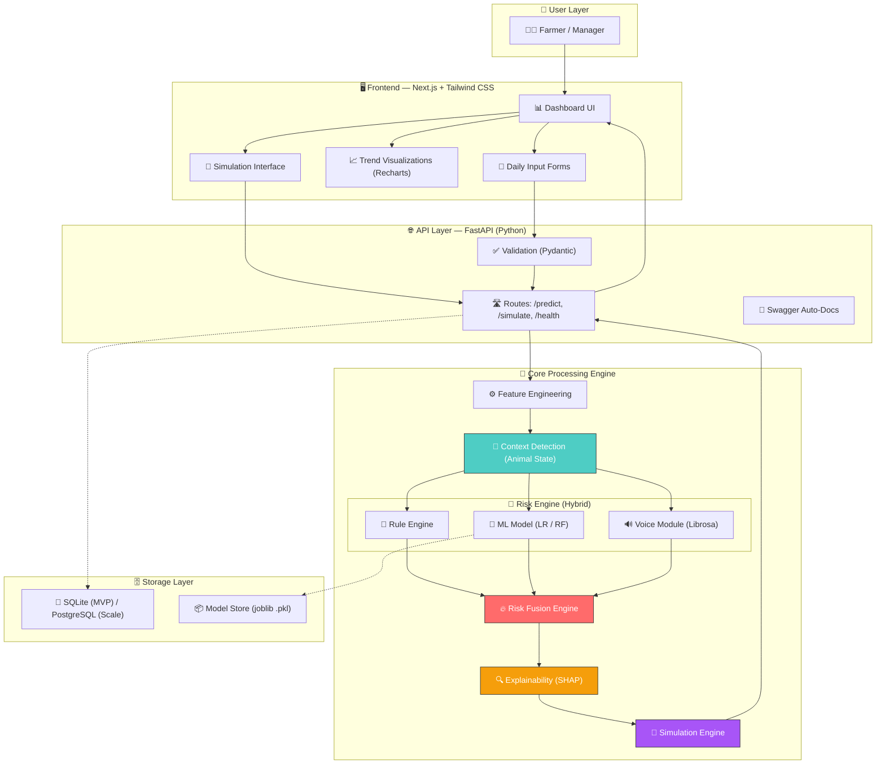

---

## 3. 🔄 End-to-End Workflow Flowchart

This is the **master flowchart** showing the complete system pipeline from farmer input to actionable output.

```mermaid
flowchart TD
    START(["🧑‍🌾 Farmer Opens App"]) --> SELECT["Select Animal by ID"]
    SELECT --> INPUT["Enter Daily Data"]
    
    INPUT --> MILK["🥛 Milk Yield (optional, numeric)"]
    INPUT --> FEED["🌾 Feed Intake (low/medium/high)"]
    INPUT --> ACTIVITY["🏃 Activity Level (low/medium/high)"]
    INPUT --> TEMP["🌡 Temperature (°C)"]
    
    MILK --> SUBMIT["📤 Submit"]
    FEED --> SUBMIT
    ACTIVITY --> SUBMIT
    TEMP --> SUBMIT
    
    SUBMIT --> VAL{"✅ Validation"}
    VAL -->|"Invalid"| ERR_422["⛔ 422: Invalid Input"]
    VAL -->|"Missing Data"| ERR_400["⛔ 400: Missing Data"]
    VAL -->|"Valid ✓"| FE_STEP["⚙ Feature Engineering"]
    
    FE_STEP --> DERIVE["Derive Signals:<br/>• milk_drop %<br/>• activity_score<br/>• feed_score<br/>• temp_risk"]
    DERIVE --> VECTOR["📊 Feature Vector"]
    
    VECTOR --> CTX_CHECK{"🎯 Context Check:<br/>Animal State?"}
    CTX_CHECK -->|"Lactating"| LACT["Use ALL signals<br/>(milk + feed + activity + temp)"]
    CTX_CHECK -->|"Dry"| DRY["Ignore milk signals<br/>(behavior + health only)"]
    
    LACT --> RISK_ENGINE["🤖 Risk Engine"]
    DRY --> RISK_ENGINE
    
    RISK_ENGINE --> RULE_CALC["📏 Rule-Based Score"]
    RISK_ENGINE --> ML_CALC["🧪 ML Prediction<br/>model.predict(features)"]
    RISK_ENGINE --> VOICE_CALC["🔊 Voice Score<br/>(optional, low weight)"]
    
    RULE_CALC --> FUSE["🔥 Risk Fusion"]
    ML_CALC --> FUSE
    VOICE_CALC --> FUSE
    
    FUSE --> SCORE["Risk Score: 0-100"]
    SCORE --> LEVEL{"Risk Level?"}
    LEVEL -->|"0-39"| LOW["🟢 LOW"]
    LEVEL -->|"40-69"| MED["🟡 MEDIUM"]
    LEVEL -->|"70-100"| HIGH["🔴 HIGH"]
    
    LOW --> EXPLAIN_STEP["🔍 Explainability<br/>(SHAP Feature Importance)"]
    MED --> EXPLAIN_STEP
    HIGH --> EXPLAIN_STEP
    
    EXPLAIN_STEP --> REASONS["📋 Top Risk Factors:<br/>• Milk decreased<br/>• Activity low<br/>• Temperature high"]
    REASONS --> ACTIONS["💊 Suggested Actions:<br/>• Improve diet<br/>• Monitor closely<br/>• Veterinary check"]
    
    ACTIONS --> RESPONSE["📤 Response to Dashboard"]
    RESPONSE --> SIM_Q{"🔮 Run Simulation?"}
    SIM_Q -->|"Yes"| SIM_MOD["User Modifies Inputs"]
    SIM_Q -->|"No"| DISPLAY["📊 Display Results"]
    
    SIM_MOD --> RECOMPUTE["Recompute Features"]
    RECOMPUTE --> RERUN["Re-run Model"]
    RERUN --> COMPARE["Compare: Before vs After"]
    COMPARE --> DELTA["Δ Delta:<br/>Before: 70 → After: 52<br/>Improvement: -18"]
    DELTA --> DISPLAY
    
    DISPLAY --> STORE["💾 Store in History (SQLite)"]
    STORE --> TREND["📈 Update Trend Charts"]
    TREND --> END_STATE(["✅ Complete"])

    style START fill:#10B981,stroke:#333,color:#fff
    style FUSE fill:#FF6B6B,stroke:#333,color:#fff
    style CTX_CHECK fill:#4ECDC4,stroke:#333,color:#fff
    style SIM_Q fill:#A855F7,stroke:#333,color:#fff
    style HIGH fill:#EF4444,stroke:#333,color:#fff
    style MED fill:#F59E0B,stroke:#333,color:#fff
    style LOW fill:#10B981,stroke:#333,color:#fff
    style END_STATE fill:#6366F1,stroke:#333,color:#fff
```

---

## 4. 🧠 Core Innovation Deep-Dives

### 4.1 🎯 Context-Aware Risk Engine (Key Innovation #1)

The system doesn't apply a single static model. It **adapts based on the animal's lifecycle stage**, which is critical for accuracy.

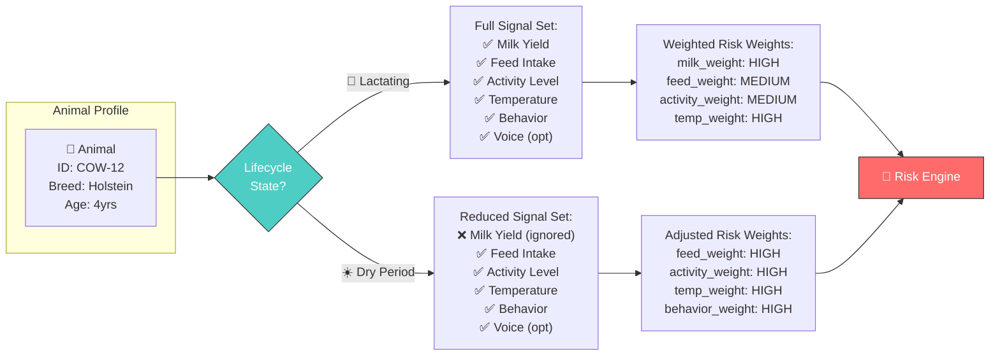

### 4.2 🔥 Multi-Signal Risk Fusion (Key Innovation #2)

Three independent scoring pathways are **fused** into a single composite risk score.

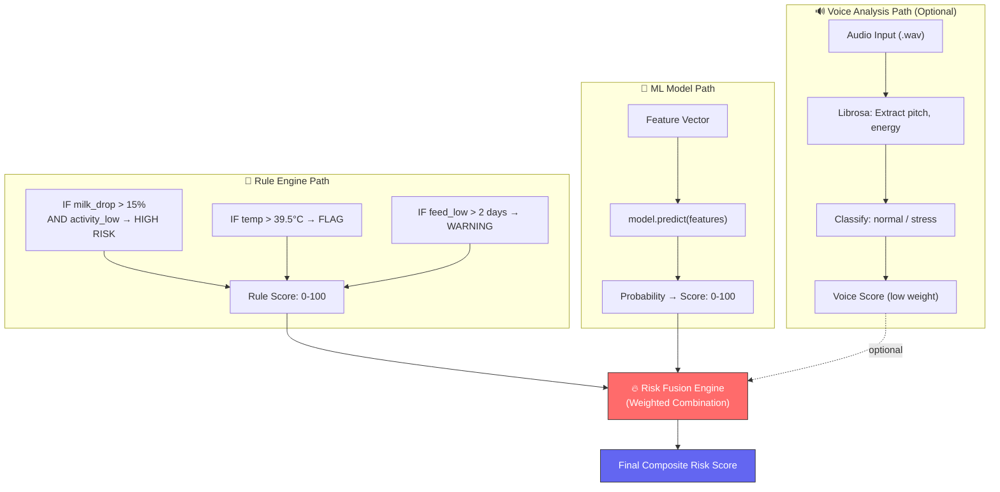

### 4.3 🔮 Simulation Engine — Unique Selling Proposition (Key Innovation #3)

The simulation engine allows farmers to **ask "what-if" questions** before taking action.

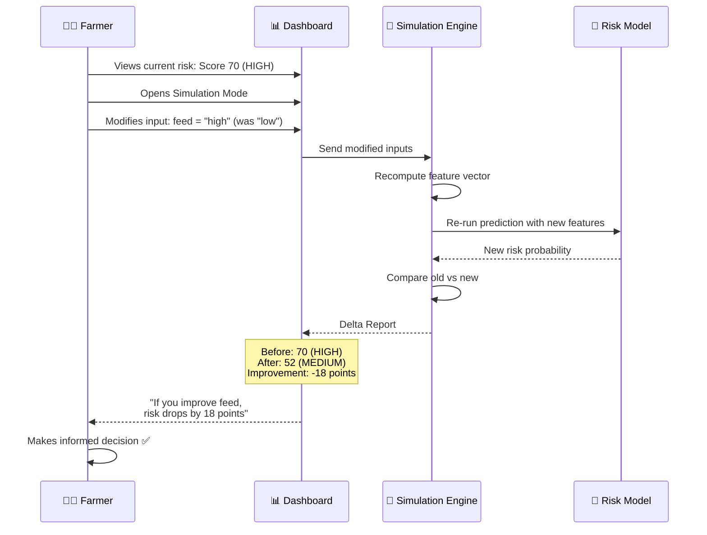

---

## 5. 🤖 ML Training Pipeline

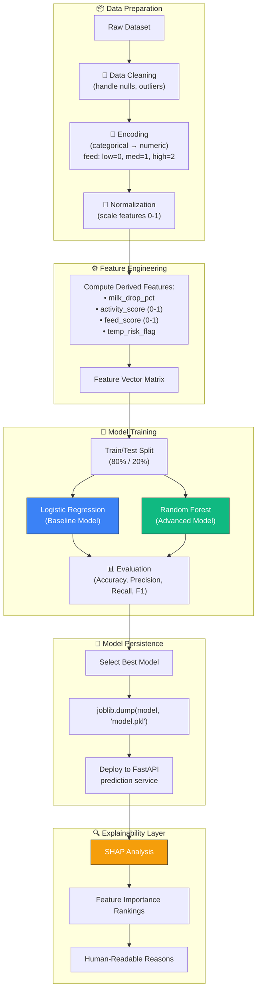

---

## 6. 📁 Project Structure & Module Map

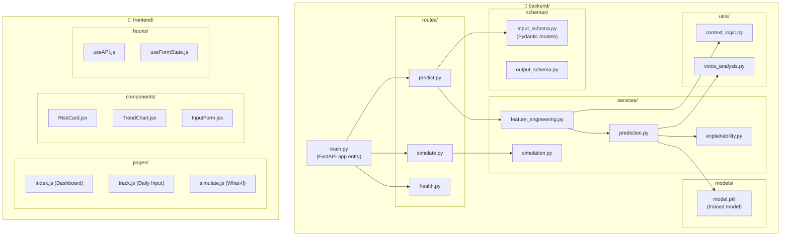

---

## 7. 🌐 API Contract

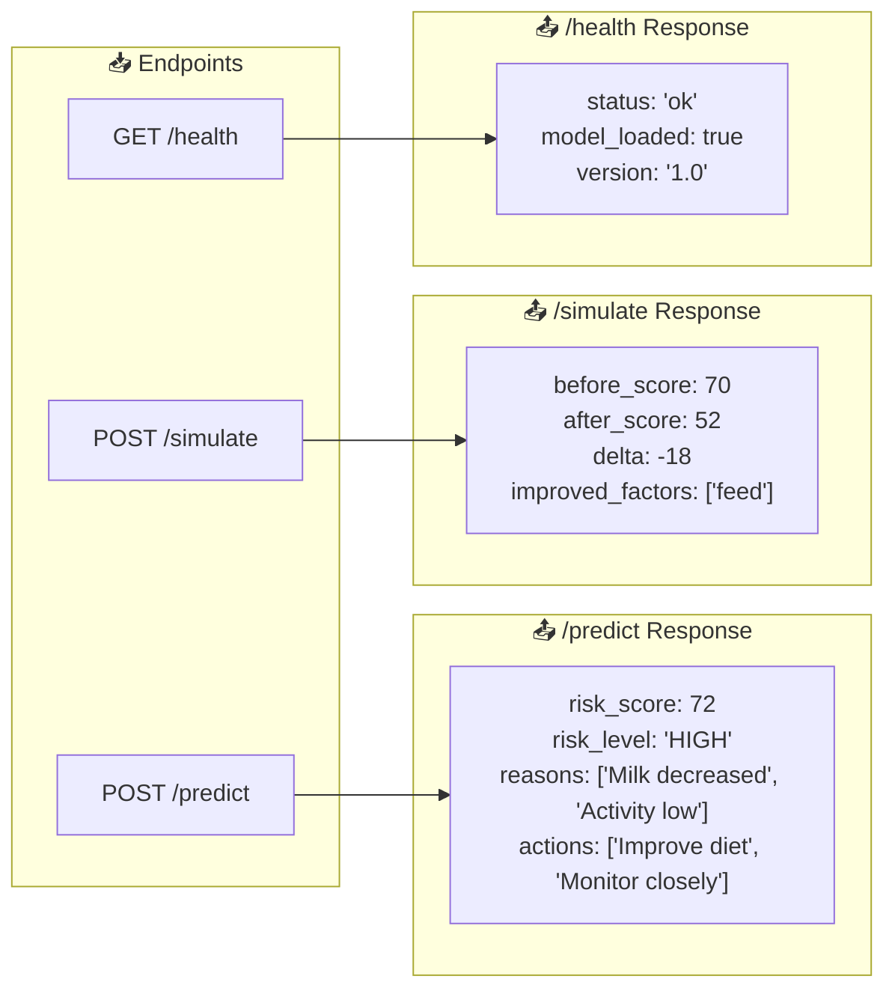

### Input Schema (Pydantic)

| Field | Type | Required | Constraints | Notes |
|---|---|---|---|---|
| `animal_id` | string | ✅ | Non-empty | Unique animal identifier |
| `breed` | string | ✅ | Enum | Animal breed |
| `age` | number | ✅ | > 0 | Age in years |
| `state` | enum | ✅ | `lactating` \| `dry` | Drives context-aware logic |
| `milk_yield` | number | ❌ | ≥ 0 | Optional; ignored if `dry` |
| `feed_intake` | enum | ✅ | `low` \| `medium` \| `high` | Categorical input |
| `activity_level` | enum | ✅ | `low` \| `medium` \| `high` | Categorical input |
| `temperature` | number | ✅ | 35–42°C | Body temperature |

### Error Handling

| HTTP Code | Condition | Trigger |
|---|---|---|
| `422` | Invalid input | Out-of-range values, wrong types |
| `400` | Missing data | Required fields absent |
| `500` | System error | Model failure, service crash |

---

## 8. 🚀 Deployment Architecture

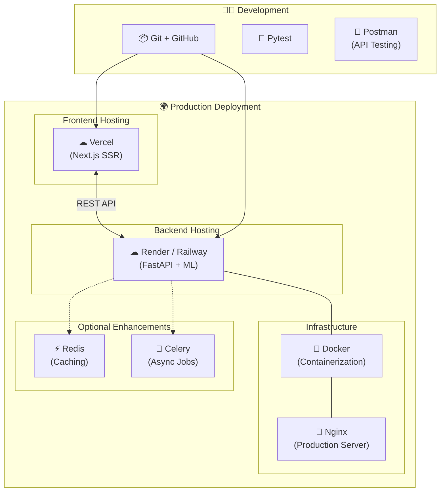

---

## 9. ⚙ Complete Tech Stack Matrix

| Layer | Technology | Purpose | Status |
|---|---|---|---|
| **Frontend Framework** | Next.js (React SSR) | Dashboard, forms, SSR | 🟢 Core |
| **UI Styling** | Tailwind CSS | Rapid UI development | 🟢 Core |
| **Charts** | Recharts | Trend visualizations | 🟢 Core |
| **State Management** | React Hooks (useState, useEffect) | Local state | 🟢 Core |
| **Form Handling** | React Hook Form | Form validation & state | 🟢 Core |
| **Backend Framework** | FastAPI (Python) | REST API, async support | 🟢 Core |
| **Validation** | Pydantic | Input/output schemas | 🟢 Core |
| **API Documentation** | Swagger (auto-generated) | Auto API docs | 🟢 Core |
| **ML Library** | scikit-learn | Model training & prediction | 🟢 Core |
| **Data Processing** | pandas, numpy | Data manipulation | 🟢 Core |
| **Model Persistence** | joblib (.pkl files) | Save/load trained models | 🟢 Core |
| **Explainability** | SHAP | Feature importance | 🟢 Core |
| **Audio Processing** | Librosa | Voice stress analysis | 🟡 Optional |
| **Database (MVP)** | SQLite | Zero-setup file-based DB | 🟢 Core |
| **Database (Scale)** | PostgreSQL | Production-grade DB | 🔵 Future |
| **Containerization** | Docker | Reproducible environments | 🟢 Core |
| **Frontend Hosting** | Vercel | Edge deployment | 🟢 Core |
| **Backend Hosting** | Render / Railway | Python service hosting | 🟢 Core |
| **Caching** | Redis | Performance optimization | 🟡 Optional |
| **Async Jobs** | Celery | Background processing | 🟡 Optional |
| **Production Server** | Nginx | Reverse proxy | 🟡 Optional |
| **Version Control** | Git + GitHub | Source management | 🟢 Core |
| **Testing** | Pytest | Unit/integration tests | 🟢 Core |
| **API Testing** | Postman | Manual API testing | 🟢 Core |

---

## 10. 📊 Feature Engineering Pipeline Detail

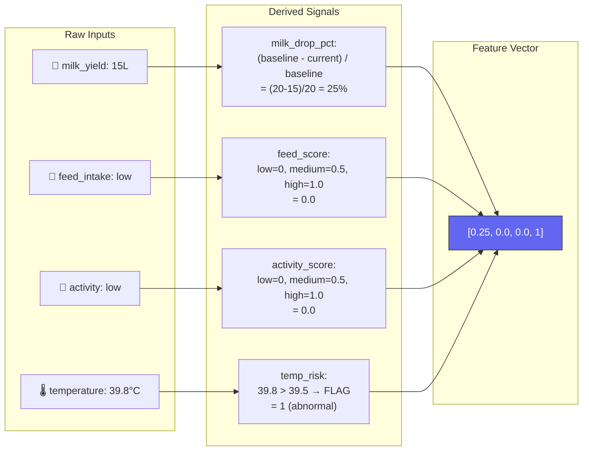

---

## 11. 📈 Trend Tracking & Alerting System

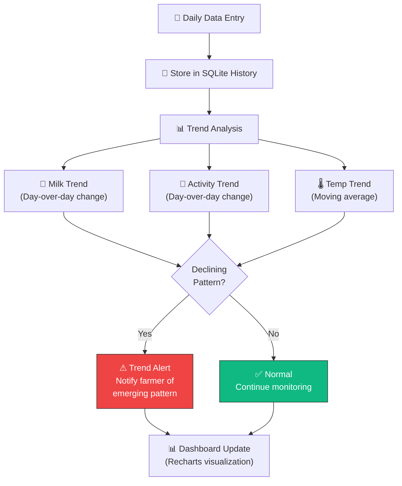

---

## 12. 🔐 Validation Flow

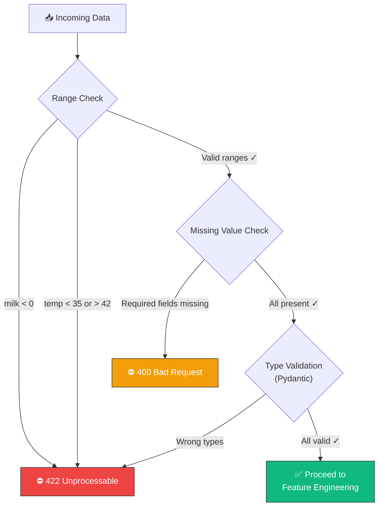

---

## 13. 🧩 Component Interaction Map

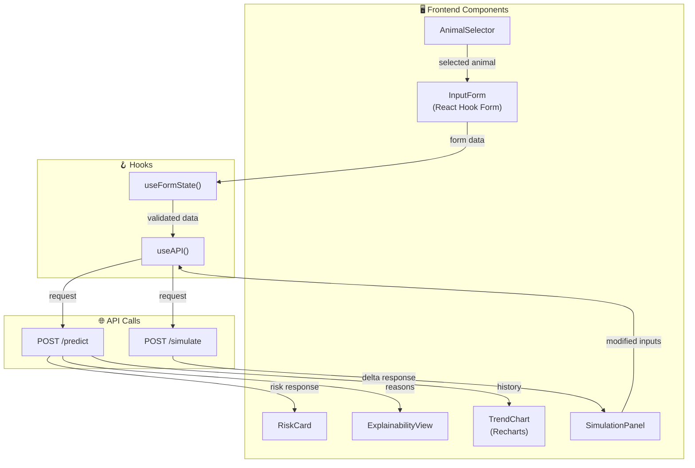

---

## 14. ⚡ Performance Requirements

| Metric | Target | Rationale |
|---|---|---|
| API Response Time | < 2 seconds | Real-time farmer usability |
| Simulation Response | < 1.5 seconds | Interactive what-if experience |
| Model Inference | Lightweight | Edge-compatible, no GPU needed |
| Frontend Load | SSR + Hydration | Fast initial paint via Next.js SSR |

---

## 15. 🔮 Future Roadmap

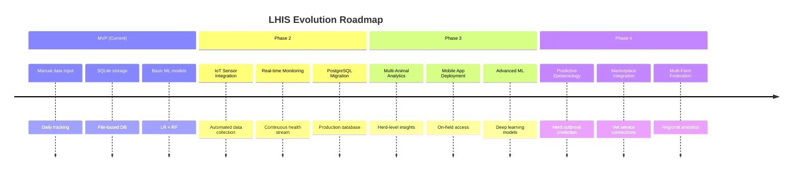

---

## 16. ⚠ Known Limitations

> [!WARNING]
> **These are acknowledged constraints of the current MVP:**

| Limitation | Impact | Mitigation Path |
|---|---|---|
| **Manual data input** | User burden, data gaps | IoT sensors in Phase 2 |
| **No clinical validation** | Not a diagnostic tool | Partner with veterinary institutions |
| **Limited dataset** | Model accuracy ceiling | Crowdsource data from pilot farms |
| **No real-time monitoring** | Delayed detection | Streaming pipeline in Phase 2 |
| **Single-animal focus** | No herd-level insights | Multi-animal analytics in Phase 3 |

---

## 17. 🧠 Cognitive Summary — Why LHIS Matters

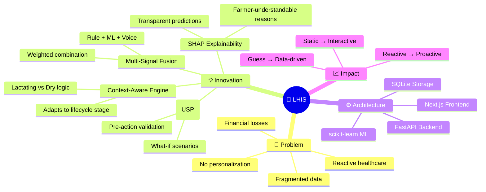

> [!IMPORTANT]
> **The three pillars that make LHIS unique:**
> 1. **Context-Awareness** — System adapts its risk calculation based on whether an animal is lactating or dry, ensuring different lifecycle stages get appropriate analysis
> 2. **Multi-Signal Fusion** — Combines rule-based logic, ML predictions, and optional voice analysis into a single risk score rather than treating signals in isolation
> 3. **Simulation Engine (USP)** — Farmers can modify inputs and see predicted risk changes *before* taking action, turning the system from an observer into a decision-support tool

---

*Analysis generated from 3 project documents comprising 21 pages of technical specification, covering system design, tech stack, and product requirements.*
