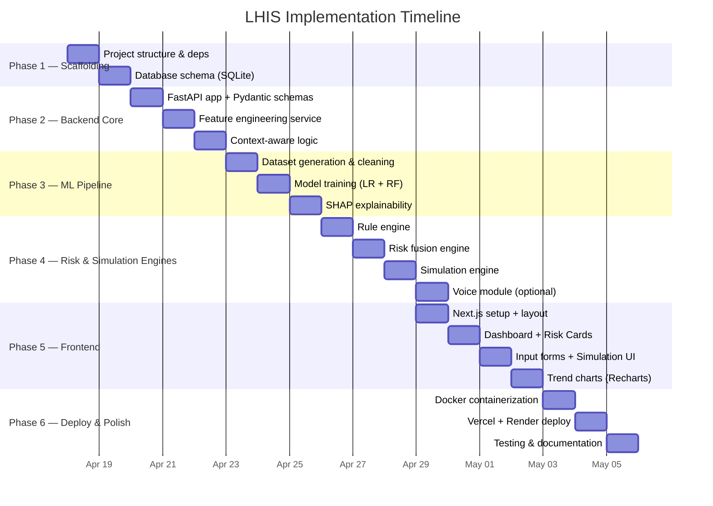
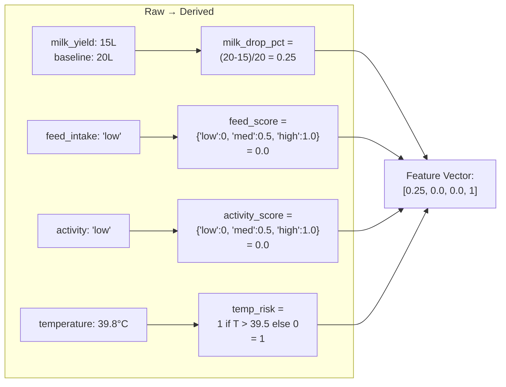
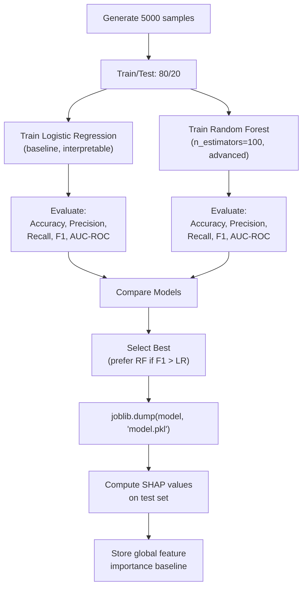
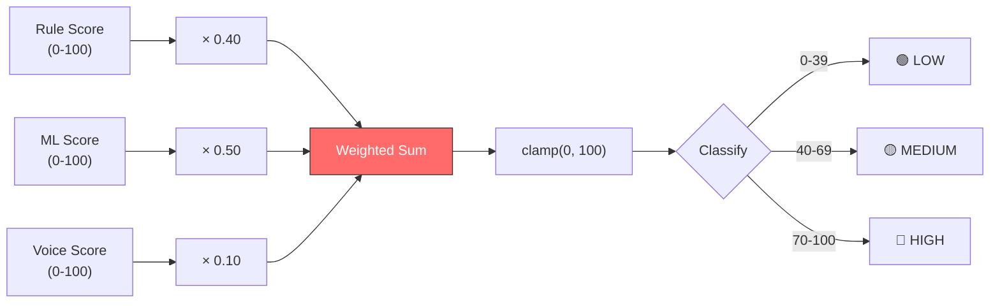
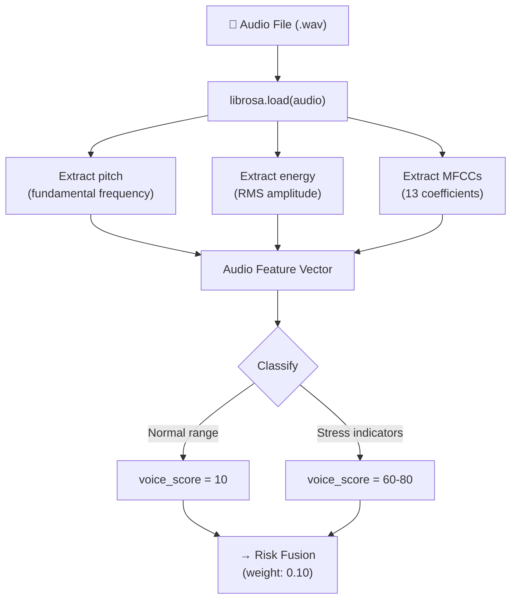
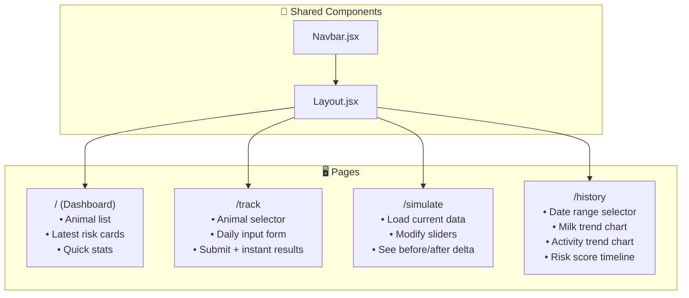
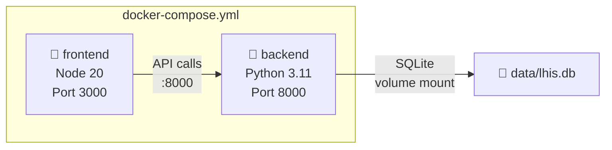

# 🏗 VETTRA-AI LHIS — Implementation Plan

> **Goal**: Build the complete Livestock Health Intelligence System from scratch, following the architecture and specifications extracted from the three project documents.

---

## Phase Overview



---

## Phase 1 — Project Scaffolding

### 1.1 Directory Structure

```
VETTRA-AI/
├── backend/
│   ├── main.py                     # FastAPI entry point
│   ├── requirements.txt            # Python dependencies
│   ├── config.py                   # App configuration
│   ├── database.py                 # SQLite connection & setup
│   │
│   ├── routes/
│   │   ├── __init__.py
│   │   ├── predict.py              # POST /predict
│   │   ├── simulate.py            # POST /simulate
│   │   ├── animals.py             # CRUD for animal profiles
│   │   └── health.py              # GET /health
│   │
│   ├── schemas/
│   │   ├── __init__.py
│   │   ├── animal.py              # AnimalProfile schema
│   │   ├── health_input.py        # DailyHealthInput schema
│   │   ├── risk_output.py         # RiskAssessment schema
│   │   └── simulation.py         # SimulationRequest/Response
│   │
│   ├── services/
│   │   ├── __init__.py
│   │   ├── feature_engineering.py  # Raw → derived signals
│   │   ├── context_logic.py       # Lactating vs Dry adaptation
│   │   ├── rule_engine.py         # Rule-based risk scoring
│   │   ├── prediction.py          # ML model inference
│   │   ├── risk_fusion.py         # Combine rule + ML + voice
│   │   ├── explainability.py      # SHAP analysis
│   │   ├── simulation.py          # What-if engine
│   │   ├── trend_analysis.py      # Historical trend detection
│   │   └── voice_analysis.py      # Optional: Librosa audio
│   │
│   ├── models/
│   │   ├── __init__.py
│   │   └── trained/               # Saved .pkl model files
│   │       ├── logistic_model.pkl
│   │       └── random_forest_model.pkl
│   │
│   ├── ml/
│   │   ├── __init__.py
│   │   ├── train.py               # Training script
│   │   ├── evaluate.py            # Evaluation metrics
│   │   └── dataset/
│   │       └── synthetic_data.csv # Training dataset
│   │
│   ├── utils/
│   │   ├── __init__.py
│   │   ├── constants.py           # Thresholds, weights
│   │   └── helpers.py             # Shared utilities
│   │
│   └── tests/
│       ├── test_predict.py
│       ├── test_simulate.py
│       └── test_feature_eng.py
│
├── frontend/
│   ├── package.json
│   ├── next.config.js
│   ├── tailwind.config.js
│   ├── postcss.config.js
│   │
│   ├── pages/
│   │   ├── _app.js
│   │   ├── index.js               # Dashboard home
│   │   ├── track.js               # Daily input page
│   │   ├── simulate.js            # Simulation page
│   │   └── history.js             # Trend history page
│   │
│   ├── components/
│   │   ├── Layout.jsx             # Shared layout wrapper
│   │   ├── Navbar.jsx             # Navigation bar
│   │   ├── AnimalSelector.jsx     # Animal dropdown/selector
│   │   ├── HealthInputForm.jsx    # Daily data entry form
│   │   ├── RiskCard.jsx           # Risk score display card
│   │   ├── ExplainPanel.jsx       # SHAP reason display
│   │   ├── SimulationPanel.jsx    # What-if input & delta
│   │   ├── TrendChart.jsx         # Recharts line chart
│   │   └── AlertBanner.jsx        # Risk level alert
│   │
│   ├── hooks/
│   │   ├── useAPI.js              # API fetch wrapper
│   │   └── useAnimal.js           # Animal context hook
│   │
│   ├── lib/
│   │   └── api.js                 # Axios/fetch config
│   │
│   └── styles/
│       └── globals.css            # Tailwind base styles
│
├── docker-compose.yml
├── Dockerfile.backend
├── Dockerfile.frontend
└── README.md
```

### 1.2 Backend Dependencies (`requirements.txt`)

```
fastapi==0.109.0
uvicorn[standard]==0.27.0
pydantic==2.5.3
scikit-learn==1.4.0
pandas==2.1.4
numpy==1.26.3
joblib==1.3.2
shap==0.44.1
librosa==0.10.1
python-multipart==0.0.6
aiosqlite==0.19.0
pytest==7.4.4
httpx==0.26.0
```

### 1.3 Frontend Dependencies (`package.json` — key deps)

```json
{
  "dependencies": {
    "next": "14.x",
    "react": "18.x",
    "react-dom": "18.x",
    "recharts": "^2.10.0",
    "react-hook-form": "^7.49.0",
    "axios": "^1.6.0",
    "lucide-react": "^0.300.0"
  },
  "devDependencies": {
    "tailwindcss": "^3.4.0",
    "postcss": "^8.4.0",
    "autoprefixer": "^10.4.0"
  }
}
```

### 1.4 Database Schema (SQLite)

```sql
-- Animal Profiles
CREATE TABLE animals (
    id TEXT PRIMARY KEY,
    name TEXT NOT NULL,
    breed TEXT NOT NULL,
    age REAL NOT NULL,
    state TEXT NOT NULL CHECK(state IN ('lactating', 'dry')),
    baseline_milk REAL DEFAULT 0,
    baseline_activity TEXT DEFAULT 'medium',
    created_at TIMESTAMP DEFAULT CURRENT_TIMESTAMP
);

-- Daily Health Records
CREATE TABLE health_records (
    id INTEGER PRIMARY KEY AUTOINCREMENT,
    animal_id TEXT NOT NULL,
    date DATE NOT NULL,
    milk_yield REAL,
    feed_intake TEXT NOT NULL CHECK(feed_intake IN ('low', 'medium', 'high')),
    activity_level TEXT NOT NULL CHECK(activity_level IN ('low', 'medium', 'high')),
    temperature REAL NOT NULL,
    risk_score REAL,
    risk_level TEXT,
    reasons TEXT,          -- JSON array of strings
    actions TEXT,          -- JSON array of strings
    created_at TIMESTAMP DEFAULT CURRENT_TIMESTAMP,
    FOREIGN KEY (animal_id) REFERENCES animals(id)
);

-- Simulation History
CREATE TABLE simulations (
    id INTEGER PRIMARY KEY AUTOINCREMENT,
    animal_id TEXT NOT NULL,
    original_score REAL NOT NULL,
    simulated_score REAL NOT NULL,
    delta REAL NOT NULL,
    modified_params TEXT NOT NULL,  -- JSON object
    created_at TIMESTAMP DEFAULT CURRENT_TIMESTAMP,
    FOREIGN KEY (animal_id) REFERENCES animals(id)
);
```

---

## Phase 2 — Backend Core

### 2.1 FastAPI Application (`main.py`)

```python
# Entry point — registers all route modules, CORS, startup events
# - Load ML model on startup
# - Initialize SQLite database
# - Mount routes: /predict, /simulate, /animals, /health
```

### 2.2 Pydantic Schemas — Full Specification

#### `schemas/health_input.py`

```python
class DailyHealthInput(BaseModel):
    animal_id: str
    milk_yield: Optional[float] = Field(None, ge=0, description="Liters; optional for dry")
    feed_intake: Literal["low", "medium", "high"]
    activity_level: Literal["low", "medium", "high"]
    temperature: float = Field(..., ge=35.0, le=42.0, description="Body temp °C")
```

#### `schemas/risk_output.py`

```python
class RiskAssessment(BaseModel):
    animal_id: str
    risk_score: float = Field(..., ge=0, le=100)
    risk_level: Literal["LOW", "MEDIUM", "HIGH"]
    reasons: List[str]
    suggested_actions: List[str]
    feature_importance: Dict[str, float]   # SHAP values
    timestamp: datetime
```

#### `schemas/simulation.py`

```python
class SimulationRequest(BaseModel):
    animal_id: str
    modified_inputs: DailyHealthInput       # Changed values

class SimulationResponse(BaseModel):
    before_score: float
    after_score: float
    delta: float
    risk_level_before: str
    risk_level_after: str
    improved_factors: List[str]
```

### 2.3 Feature Engineering — Formulas



**Implementation:**

| Derived Feature | Formula | Range |
|---|---|---|
| `milk_drop_pct` | `(baseline_milk - current_milk) / baseline_milk` | 0.0 – 1.0+ |
| `feed_score` | `{'low': 0.0, 'medium': 0.5, 'high': 1.0}[input]` | 0.0 – 1.0 |
| `activity_score` | `{'low': 0.0, 'medium': 0.5, 'high': 1.0}[input]` | 0.0 – 1.0 |
| `temp_risk` | `1 if temperature > 39.5 else (0.5 if temp > 39.0 else 0)` | 0 – 1 |
| `temp_deviation` | `abs(temperature - 38.5) / 3.5` (normalized) | 0.0 – 1.0 |

### 2.4 Context-Aware Logic

```python
# services/context_logic.py
def apply_context(features: dict, animal_state: str) -> dict:
    """
    CRITICAL: Adapts feature set based on lifecycle stage.
    - Lactating → use ALL signals including milk
    - Dry → REMOVE milk signals, upweight behavior + health
    """
    if animal_state == "dry":
        features["milk_drop_pct"] = 0.0       # Neutralize
        features["milk_weight"] = 0.0          # Zero weight in fusion
        features["feed_weight"] = 1.5          # Upweight
        features["activity_weight"] = 1.5      # Upweight
    else:  # lactating
        features["milk_weight"] = 1.0
        features["feed_weight"] = 1.0
        features["activity_weight"] = 1.0
    return features
```

---

## Phase 3 — ML Pipeline

### 3.1 Synthetic Dataset Generation

Since no real dataset exists, generate a synthetic training set:

| Feature | Distribution | Notes |
|---|---|---|
| `milk_drop_pct` | Uniform(0, 0.5) | 0 = no drop, 0.5 = 50% drop |
| `feed_score` | Categorical {0, 0.5, 1} | Mapped from low/med/high |
| `activity_score` | Categorical {0, 0.5, 1} | Mapped from low/med/high |
| `temp_risk` | Binary {0, 1} | Based on threshold |
| `is_sick` (label) | Binary {0, 1} | Target variable |

**Label logic for synthesis:**
```python
is_sick = 1 if (milk_drop > 0.15 and activity < 0.5) or temp_risk == 1 else 0
# Add noise: flip 5% of labels for realism
```

### 3.2 Model Training Flow



### 3.3 SHAP Explainability Integration

```python
# services/explainability.py
import shap

def explain_prediction(model, features: np.ndarray, feature_names: list) -> dict:
    """
    Returns human-readable explanations for why a risk score was assigned.
    
    Output example:
    {
        "top_factors": [
            {"feature": "milk_drop_pct", "impact": 0.32, "direction": "increases risk"},
            {"feature": "activity_score", "impact": 0.28, "direction": "increases risk"},
        ],
        "reasons": ["Milk yield decreased significantly", "Activity level is low"],
        "shap_values": {...}
    }
    """
    explainer = shap.TreeExplainer(model)  # or LinearExplainer for LR
    shap_values = explainer.shap_values(features)
    # Map SHAP values to human-readable reasons
    ...
```

**Reason Mapping Table:**

| Feature | High Impact Direction | Human-Readable Reason |
|---|---|---|
| `milk_drop_pct` | > 0.15 increases risk | "Milk yield has decreased significantly" |
| `feed_score` | Low (0.0) increases risk | "Feed intake is critically low" |
| `activity_score` | Low (0.0) increases risk | "Activity level has dropped" |
| `temp_risk` | 1 increases risk | "Body temperature is abnormally high" |
| `temp_deviation` | High increases risk | "Temperature deviates from normal range" |

---

## Phase 4 — Risk & Simulation Engines

### 4.1 Rule Engine — Logic Table

```python
# services/rule_engine.py

RULES = [
    # (condition_fn, risk_contribution, reason)
    (lambda f: f["milk_drop_pct"] > 0.15 and f["activity_score"] < 0.5,
     30, "Milk drop combined with low activity → HIGH RISK"),
     
    (lambda f: f["temp_risk"] == 1,
     25, "Body temperature is abnormally high"),
     
    (lambda f: f["feed_score"] == 0.0,
     20, "Feed intake is critically low"),
     
    (lambda f: f["activity_score"] == 0.0,
     15, "No physical activity detected"),
     
    (lambda f: f["milk_drop_pct"] > 0.25,
     20, "Severe milk yield decline (>25%)"),
     
    (lambda f: f["feed_score"] == 0.0 and f["temp_risk"] == 1,
     10, "Low feed + fever combination"),
]
```

### 4.2 Risk Fusion Formula



**Fusion formula:**
```
final_score = clamp(
    rule_score × 0.40 +
    ml_score   × 0.50 +
    voice_score × 0.10,    # 0 if no audio
    0, 100
)
```

**Risk level thresholds:**

| Score Range | Level | Color | Action Priority |
|---|---|---|---|
| 0 – 39 | LOW | 🟢 Green | Routine monitoring |
| 40 – 69 | MEDIUM | 🟡 Amber | Increased observation |
| 70 – 100 | HIGH | 🔴 Red | Immediate intervention |

### 4.3 Simulation Engine — Implementation

```python
# services/simulation.py

async def run_simulation(
    animal_id: str,
    original_input: DailyHealthInput,
    modified_input: DailyHealthInput,
    model, db
) -> SimulationResponse:
    """
    1. Compute features for ORIGINAL input → get original score
    2. Compute features for MODIFIED input → get simulated score
    3. Calculate delta and identify which factors improved
    """
    original_features = engineer_features(original_input, animal)
    modified_features = engineer_features(modified_input, animal)
    
    original_score = predict_risk(model, original_features)
    simulated_score = predict_risk(model, modified_features)
    
    delta = simulated_score - original_score
    improved = [f for f in feature_names 
                if modified_features[f] < original_features[f]]
    
    return SimulationResponse(
        before_score=original_score,
        after_score=simulated_score,
        delta=delta,
        risk_level_before=classify(original_score),
        risk_level_after=classify(simulated_score),
        improved_factors=improved
    )
```

### 4.4 Voice Module (Optional)



---

## Phase 5 — Frontend

### 5.1 Page Architecture



### 5.2 Component Specifications

| Component | Props | Functionality |
|---|---|---|
| **`AnimalSelector`** | `animals[]`, `onSelect` | Dropdown to pick animal, fetches profile |
| **`HealthInputForm`** | `animal`, `onSubmit` | React Hook Form — milk, feed, activity, temp fields |
| **`RiskCard`** | `score`, `level`, `reasons` | Colored card (green/amber/red) with score gauge |
| **`ExplainPanel`** | `featureImportance`, `reasons` | SHAP bar chart + human-readable bullet points |
| **`SimulationPanel`** | `currentData`, `onSimulate` | Slider inputs + before/after comparison display |
| **`TrendChart`** | `history[]`, `metric` | Recharts `<LineChart>` for milk, activity, risk over time |
| **`AlertBanner`** | `level`, `message` | Top-of-page alert for HIGH risk animals |

### 5.3 Dashboard Layout Wireframe

```
┌─────────────────────────────────────────────────────────┐
│  🧠 LHIS — Livestock Health Intelligence System   [Nav] │
├─────────────────────────────────────────────────────────┤
│                                                         │
│  📊 Quick Overview                                      │
│  ┌──────────┐  ┌──────────┐  ┌──────────┐              │
│  │ Total    │  │ At Risk  │  │ Healthy  │              │
│  │ Animals  │  │  🔴 3    │  │  🟢 12   │              │
│  │   15     │  │          │  │          │              │
│  └──────────┘  └──────────┘  └──────────┘              │
│                                                         │
│  🐄 Animal Risk Cards                                   │
│  ┌─────────────────┐  ┌─────────────────┐              │
│  │ Cow #12         │  │ Cow #7          │              │
│  │ Risk: 72 🔴     │  │ Risk: 35 🟢     │              │
│  │ ⚠ Milk ↓ 25%   │  │ ✅ All normal   │              │
│  │ ⚠ Activity low  │  │                 │              │
│  │ [View] [Sim]    │  │ [View] [Sim]    │              │
│  └─────────────────┘  └─────────────────┘              │
│                                                         │
│  📈 Herd Health Trend (7-day)                           │
│  ┌─────────────────────────────────────────┐            │
│  │  ──────────────────────                 │            │
│  │     Risk Score Trend (Recharts)         │            │
│  └─────────────────────────────────────────┘            │
│                                                         │
└─────────────────────────────────────────────────────────┘
```

### 5.4 Simulation Page Wireframe

```
┌─────────────────────────────────────────────────────────┐
│  🔮 Simulation Engine — What-If Analysis                │
├─────────────────────────────────────────────────────────┤
│                                                         │
│  Animal: [Cow #12 ▼]         Current Risk: 72 🔴        │
│                                                         │
│  ┌─────────── Current ───────┐  ┌──── Modified ────────┐│
│  │ Milk:     15L             │  │ Milk:     [15L    ]  ││
│  │ Feed:     low             │  │ Feed:     [high ▼ ]  ││
│  │ Activity: low             │  │ Activity: [med  ▼ ]  ││
│  │ Temp:     39.8°C          │  │ Temp:     [39.8   ]  ││
│  └───────────────────────────┘  └──────────────────────┘│
│                                                         │
│                  [▶ Run Simulation]                      │
│                                                         │
│  ┌─────────────── Results ──────────────────┐           │
│  │                                          │           │
│  │  Before:  72  🔴 HIGH                    │           │
│  │  After:   48  🟡 MEDIUM                  │           │
│  │  Delta:  -24  ⬇ improvement              │           │
│  │                                          │           │
│  │  Improved Factors:                       │           │
│  │    ✅ Feed intake (low → high)           │           │
│  │    ✅ Activity level (low → medium)      │           │
│  │                                          │           │
│  └──────────────────────────────────────────┘           │
└─────────────────────────────────────────────────────────┘
```

---

## Phase 6 — Deployment & Polish

### 6.1 Docker Configuration



**`Dockerfile.backend`:**
```dockerfile
FROM python:3.11-slim
WORKDIR /app
COPY requirements.txt .
RUN pip install --no-cache-dir -r requirements.txt
COPY . .
CMD ["uvicorn", "main:app", "--host", "0.0.0.0", "--port", "8000"]
```

**`Dockerfile.frontend`:**
```dockerfile
FROM node:20-alpine
WORKDIR /app
COPY package*.json ./
RUN npm ci
COPY . .
RUN npm run build
CMD ["npm", "start"]
```

### 6.2 Deployment Topology

| Component | Platform | URL Pattern |
|---|---|---|
| Frontend | Vercel | `https://lhis.vercel.app` |
| Backend | Render / Railway | `https://lhis-api.onrender.com` |
| Database | SQLite (embedded) | Bundled with backend container |

### 6.3 Environment Variables

```env
# Backend
DATABASE_URL=sqlite:///./data/lhis.db
MODEL_PATH=./models/trained/random_forest_model.pkl
CORS_ORIGINS=http://localhost:3000,https://lhis.vercel.app

# Frontend
NEXT_PUBLIC_API_URL=http://localhost:8000
```

---

## Verification Plan

### Automated Tests

| Test | Tool | Command | Covers |
|---|---|---|---|
| Unit tests | Pytest | `pytest backend/tests/ -v` | Feature engineering, rule logic, context |
| API tests | Pytest + httpx | `pytest backend/tests/test_predict.py` | Endpoint validation, schemas |
| ML model accuracy | Training script | `python backend/ml/evaluate.py` | F1 > 0.85 on test set |
| Frontend build | Next.js | `npm run build` | No build errors |

### Manual Verification

| Check | Expected |
|---|---|
| Submit daily data for lactating cow → see risk score + reasons | Score 0-100, colored level, ≥1 reason |
| Submit daily data for dry cow → milk field ignored | Risk computed without milk influence |
| Run simulation with improved feed → score drops | Delta is negative, improved factors listed |
| View trend history for 7 days → charts render | Recharts line graphs with data points |
| Hit `/health` endpoint → system ok | `{"status": "ok", "model_loaded": true}` |

---

## Execution Checklist

- [ ] **Phase 1**: Project scaffold + SQLite schema
- [ ] **Phase 2**: FastAPI + schemas + feature engineering + context logic  
- [ ] **Phase 3**: Synthetic dataset + train models + SHAP integration
- [ ] **Phase 4**: Rule engine + risk fusion + simulation engine
- [ ] **Phase 5**: Next.js frontend + all components + pages
- [ ] **Phase 6**: Docker + deploy + tests + documentation

> [!IMPORTANT]
> **Decision Point**: Before proceeding with implementation, please confirm:
> 1. Should I build the complete system end-to-end, or focus on specific phases first?
> 2. Do you want the voice analysis module (Librosa) included in the MVP, or defer it?
> 3. Any preferred color scheme / branding for the frontend dashboard?
